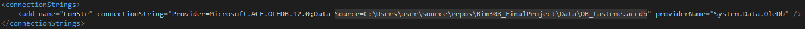
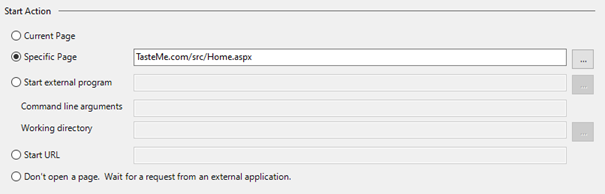
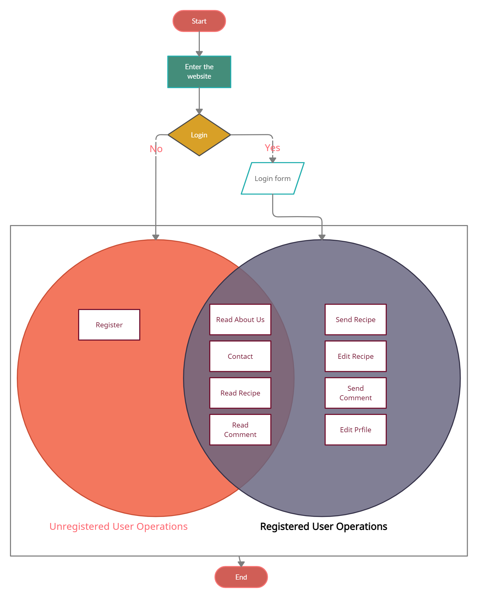

# TasteMe.com

TasteMe.com is a web application where anyone can easily find, read, and share recipes.

Resources Management:
1.	Storing material information.
2.	Adding, removing, editing Materials.
3.	Multiple storage management.
4.	Keeping records of material entry/exit to the Storage.

### Running

1.	Change the connection string Source to locate DB_tasteme.accdb

2.	Change Solution > App > Properties >Web > Start Action to Specific Page: TasteMe.com/src/Home.aspx

3.	Clean the solution
4.	Build the solution
5.	Run

### WEB-APPLİCATIN FLOW CHART

## License

This project is licensed under the MIT License - see the [LICENSE.md](LICENSE.md) file for details
